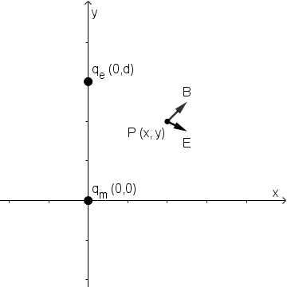

## Dirac Quantization Condition

To calculate the angular momentum generated by a pair of electric-magnetic charge with distance *d*, let's put the magnetic charge at origin and electric charge at (0, *d*, 0), then look at **B** and **E** at point *P* on plane *xOy*:

The momentum density at *P* is:

The total angular momentum around axis *y* is:

Let's assume the angular momentum meets *n* multiples of , then we get the Dirac quantization condition:

i.e.

